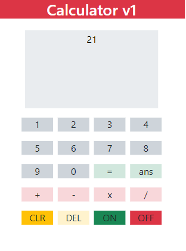

# Calculator v1

This repository contains the source code and assets for the [Calculator v1 Project](https://jesseross001.github.io/Calculator/). A simple and intuitive calculator built to perform basic arithmetic operations.

## Features
- Basic arithmetic operations (addition, subtraction, multiplication, division)
- Clear, delete, and reset functionality
- Responsive design suitable for desktop and mobile use

## Technologies Used
- HTML
- CSS
- JavaScript

## Usage
- Click on the numbers and operators to input calculations.
- Click "=" to get the answer.
- Click "CLR" to clear the screen.
- Click "DEL" to delete the last character.
- Click "ON" to turn on the calculator.
- Click "OFF" to turn off the calculator.

## Contributing
If you'd like to contribute, please fork the repository and use a feature branch. Pull requests are warmly welcome.

## Links
- Repository: https://github.com/jesseross001/Calculator
- Issue tracker: https://github.com/jesseross001/Calculator/issues

## Licensing
The code in this project is licensed under MIT license. See the [LICENSE](LICENSE.md) file for more information.

## Author
- Jesse Ross - jesseross001@gmail.com

## Acknowledgements
- Inspired by traditional pocket calculators.

